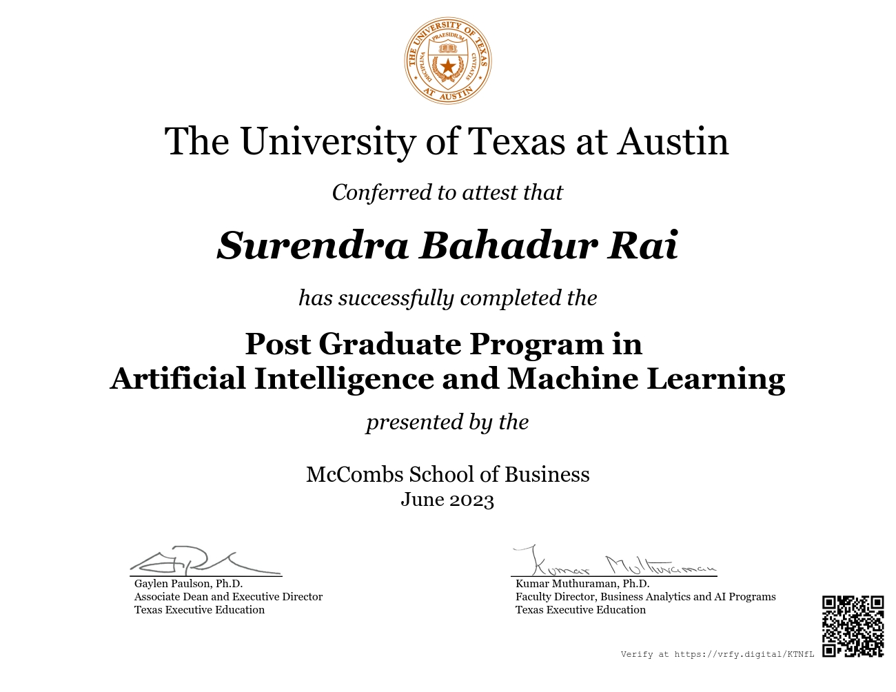
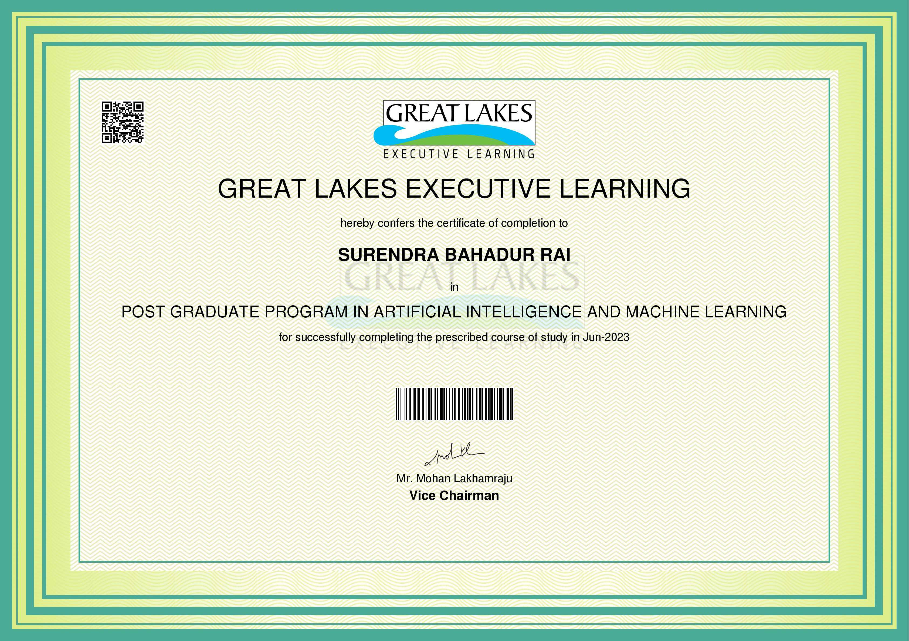

**Name:** Surendra Bahadur Rai

**LinkedIn Connect :** https://www.linkedin.com/in/surendra-bahadur-rai-14561818/

**My Profile:**
https://la.utexas.edu/texasexeced/digitalVerification.html?key=KTNfL

https://olympus1.mygreatlearning.com/certificate/OFFEOFKF

**Project and Assignment In Profile:**

https://eportfolio.mygreatlearning.com/surendra-bahadur-rai

I learn thise Course from The Univercity of Texax in austin and Then Deakin Univercity. Provided by Greate-lack from great-learning.

- Artificial Intelligent Machine Learing  and Data Scince and analytics (AIML Post Graduate Program)
- Master In Globale Data Scientist (Master In Data Science Graduate Degree Programs)

## I learng From This Two Univercity
 
 ## First Year

 - Python Progrmaign I and II
 - Applied Mathematics Statatistics
 - Machine Learing Algorithm theory and Mathematics
    - Supervice Machine Learing
    - Unsupervice Machine Learing
    - Ensemble Learning 
    - Reinforcement Machine Learing
    - Neural Network and Deep Learing
    - Feature Enginering
    - Time Series Forecasting
    - Recomendation System
    - Statistical Data Analytic
    - Model Hypterparamter Tuning and Model Evalution and Matrix
    - Computer vision ( Object Detection, Image Classification, other related compute vision staff )
    - NLP Natural Language Procession with ML Algorightm
    - Recomentation System and Syntiment Analysis

## Second year
 - Machine Learing Algoritm and Mathematics
 - Advance Python Programing and ML related libray and tools 
 - Practice Exersize and Project
 - Big Data Hadoop System and Pyspark and Big Data Analitic
 - Python Data Extraction, Injection to Relation Database
 - SQL Programing 
 - Lab Exerisse and Project Assignment 
 - R-Programing Languge 
 - Applied Statatical Analysis Mathematic In R-Proraming language
 - Real World Data analytics
 - Linear programing in R-Languge 
 - Mathematic in Geme theory Mathematic in R-Lanauge
 - Data Wrangling (python numpy, pyspark, R-laguage)
 - Data Visualiation and Statistical analytics (Power BI and Tableau)
 - Machine Learing Mathematic
    - Statistic Mathematic
    - Liner Algebra mathematic I and II  
    - Calculs, Vector, Grap
    - Probability
    - Probability and Statistic
 - Enginering AI Solution 
    - Modern AI Software Development Process
    - Data Governance and Complaince and security
    - Artifical Inteligent System
    - Azure Machine Learing
    - Azure Ml Model Deployment
    - Mlops Operations 
    - Azure Computer vision , Azure Custome Vision
    - Azure openAi
    - practice and project Assignment
  - Generative AI
    - NLP(Natural Lanauge Processing) 
    - Sequencial Data Learing Algoritm , RNN, LSTM and GRU
    - (https://towardsdatascience.com/illustrated-guide-to-lstms-and-gru-s-a-step-by-step-explanation-44e9eb85bf21)
    - Large Languate Model: like GPT-3.5 turbo, GPT-40 & meta LLama3.1 etc
    - Openai, azure ml, azure vision and custom vision  
    - Hugging Face,Transformers, LangChain framework & librery , vectordb
    - word embeding Techniques
       - TF-IDF (Term Frequency-Inverse Document Frequency )
       - word2vec
       - Global Vector for Word Representation (Glove)
       - BERT
       - Bag of Words(BoW)
       - Fasttext 
    - NLTK,gensim & SpaCy Language Processiong library 

## Basic Python key
https://www.pythontutorial.net/

https://python-course.eu/

**Notebooks details:**

1.	Supervised Learning
  - Medical : Patient Condition Prediction
  - Banking : Predicting Loan Eligibility
2.	Unsupervised Learning 
  - Automobile : Segment Categorization Of Cars
  - Automobile : Vehicle Silhouette Classification
3.	Ensemble Techniques 
  - Telecom : Customer Churn Probability Classification
  - Telecom : Customer Churn Probability Classification : Modularization For Maintainability
4.	Feature Engineering & Elimination, Model Selection & Tuning -
  - Semiconductor Industry : Manufacturing Process Yield Prediction
5.	Recommendation Systems
  - Smartphone, Electronics : Mobile Phone Recommendation System 
6.	Neural Networks ANN
  - Electronics & Communication : Signal Quality Prediction
  - Autonomous Vehicles : SVHN Photograph Digit Classification
7.	Computer Vision –
  - Botanical Research : Plant Species 3D Image Classification
  - Entertainment : Masked Image Face Detection
  - Botanical Research : Flower Image Classification
  - Face Recognition : Masked Image Face Identification
  - Entertainment : Movie Cast & Crew Classification : Image Dataset Creation For Classification
8.	Natural Language Processing –
  - Digital Content Management : Blog Topic Classification
  - Social Media Analytics : Sarcasm Detection
  - Customer Support : Interactive Semi - Rule Based Chatbot
  - Digital content and entertainment industry : IMDB Review Customer Sentiment Analysis

**Data Analysis in Python**

[https://wesmckinney.com/book/time-series](https://wesmckinney.com/book/time-series)

**Data Wrangaling Python**

[https://datawranglingpy.gagolewski.com/index.html](https://datawranglingpy.gagolewski.com/index.html)

**Forecasting: Principles and Practice**

[https://otexts.com/fpp3/intro.html](https://otexts.com/fpp3/intro.html)

### R-Biginer Free Learning

**Learn R pgrograming**

[https://learnetutorials.com/r-programming](https://learnetutorials.com/r-programming)

[https://sparkbyexamples.com/r-tutorial-with-examples/](https://sparkbyexamples.com/r-tutorial-with-examples/)

## R Cook Book

[https://rc2e.com/](https://rc2e.com/)

**R for Social Scientists**

[https://datacarpentry.org/r-socialsci/01-intro-to-r.html](https://datacarpentry.org/r-socialsci/01-intro-to-r.html)

**Data-Wrangling**

[https://bookdown.org/jgscott/DSGI/data-wrangling.html](https://bookdown.org/jgscott/DSGI/data-wrangling.html)

[https://r4ds.had.co.nz/index.html](https://r4ds.had.co.nz/index.html)

**R Programming for Data Science:**

[https://deepr.gagolewski.com/](https://deepr.gagolewski.com/)

 [https://bookdown.org/rdpeng/rprogdatascience/](https://bookdown.org/rdpeng/rprogdatascience/) 

 **Under stating R- Mean, median, Harmonic Mean, Weight mean,Geometric Mean**

 [https://www.gs.washington.edu/academics/courses/akey/56008/lecture/](https://www.gs.washington.edu/academics/courses/akey/56008/lecture/)

 
**Probability for Data Science**

[https://probability4datascience.com/lecture.html](https://probability4datascience.com/lecture.htm)

[https://probability4datascience.com/video_ch01.html](https://probability4datascience.com/video_ch01.html)

### R Programing language and practice Link
### This is helpfull for Data Scientist People.  How mathematical Equation drow in document as well as Statistical Analysis Viewing the Reports

**Basic Mathematical Equation formula**
[https://rpruim.github.io/s341/S19/from-class/MathinRmd.html](https://rpruim.github.io/s341/S19/from-class/MathinRmd.html)

[https://bookdown.org/yihui/rmarkdown/markdown-syntax.html#inline-formatting](https://bookdown.org/yihui/rmarkdown/markdown-syntax.html#inline-formatting)

### Reference Link

[https://book.stat420.org/index.html](https://book.stat420.org/index.html)

[https://rmarkdown.rstudio.com/lesson-1.html](https://rmarkdown.rstudio.com/lesson-1.html)

[https://bookdown.org/fmcron/Rhodes-template](https://bookdown.org/fmcron/Rhodes-template)

[https://cran.r-project.org/web/packages/kableExtra/vignettes/awesome_table_in_html.html#Installation](https://cran.r-project.org/web/packages/kableExtra/vignettes/awesome_table_in_html.html#Installation)
